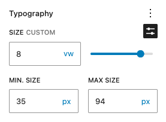

# Clamp Typography

A WordPress plugin that provides precise control over fluid typography for heading blocks using CSS clamp() functions.


## 🎯 Overview

When `styles.typography.fluid` is enabled within `theme.json`, wordpress uses `wp_get_typography_font_size_value` to automatically calculate a min and max value for heading blocks. For example, a custom font size such as `96px` turns into `clamp(48.588px, 3.037rem + ((1vw - 3.2px) * 3.436), 96px)`. This is great, however in some curcumstances a more precise min and max value is required.

Clamp Typography enhances WordPress heading blocks with a minimum and maximum field under the custom font size field, allowing you to have precise control over the clamp output on the core/heading blocks.


## ✨ Features

- **🎛️ Intuitive Controls**: Simple min/max size inputs integrated directly into the WordPress block editor
- **🤖 Smart Defaults**: Automatically calculates reasonable min/max values based on your chosen font size
- **🎨 Theme Integration**: Works seamlessly with your theme's font size presets and custom font sizes
- **📱 Responsive Typography**: Creates fluid typography that scales smoothly between breakpoints
- **⚡ Performance Optimized**: Lightweight implementation with no frontend JavaScript
- **🔧 Developer Friendly**: Clean, extensible code with hooks and filters

## 🚀 Installation

### From GitHub

1. Download the latest release from the [releases page](../../releases)
2. Upload the plugin folder to `/wp-content/plugins/`
3. Activate the plugin through the 'Plugins' menu in WordPress

### Development Setup

```bash
git clone https://github.com/yourusername/clamp-typography.git
cd clamp-typography
npm install
npm run build
```

## 📖 Usage

### Basic Usage

1. **Add a Heading Block** in the WordPress editor
2. **Set a Font Size** using either:
   - Theme font size presets (Small, Medium, Large, etc.)
   - Custom font size values (18px, 1.2rem, etc.)
3. **Configure Clamp Values** in the Typography panel:
   - **Min Size**: Smallest font size for mobile devices
   - **Max Size**: Largest font size for desktop screens
4. **Publish** and see your fluid typography in action!


*The clamp typography controls integrated seamlessly into the WordPress block editor's Typography panel*

### How It Works

The plugin automatically converts fixed font sizes into CSS clamp() functions:

```css
/* Before: Fixed font size */
font-size: 18px;

/* After: Fluid typography */
font-size: clamp(14.4px, 18px, 21.6px);
```

### Smart Defaults

When you select a font size, the plugin automatically suggests:

- **Min Size**: 80% of your chosen font size
- **Max Size**: 120% of your chosen font size

You can customize these values to fit your design needs.

## 🎨 Examples

### Small Heading (Mobile-first)

```css
font-size: clamp(16px, 4vw, 24px);
```

### Large Display Heading

```css
font-size: clamp(28px, 6vw, 48px);
```

### Subtle Scaling

```css
font-size: clamp(18px, 2.5vw, 22px);
```

## 🛠️ Technical Details

### Requirements

- **WordPress**: 6.7 or higher
- **PHP**: 7.4 or higher
- **Browser Support**: All modern browsers supporting CSS clamp()

### Block Support

Currently supports:

- ✅ Heading blocks (H1-H6)
- 🔄 More blocks coming soon

### WordPress Integration

- Uses `wp_get_typography_font_size_value()` for accurate font size resolution
- Integrates with `theme.json` font size presets
- Compatible with Full Site Editing (FSE)
- Follows WordPress coding standards

## 🔧 Development

### Build Process

```bash
# Development build with watch
npm run start

# Production build
npm run build

# Linting
npm run lint:js
npm run lint:php
```

### Project Structure

```
clamp-typography/
├── src/
│   └── index.js          # Block editor JavaScript
├── build/                # Compiled assets
├── clamp-typography.php  # Main plugin file
├── package.json
└── README.md
```

### Hooks & Filters

```php
// Modify clamp calculation
add_filter('clamp_typography_calculate_defaults', function($defaults, $base_size) {
    // Custom calculation logic
    return $defaults;
}, 10, 2);

// Filter supported blocks
add_filter('clamp_typography_supported_blocks', function($blocks) {
    $blocks[] = 'core/paragraph';
    return $blocks;
});
```

## 🤝 Contributing

Contributions are welcome! Please read our [Contributing Guidelines](CONTRIBUTING.md) before submitting pull requests.

### Development Workflow

1. Fork the repository
2. Create a feature branch (`git checkout -b feature/amazing-feature`)
3. Make your changes
4. Run tests and linting (`npm run lint`)
5. Commit your changes (`git commit -m 'Add amazing feature'`)
6. Push to the branch (`git push origin feature/amazing-feature`)
7. Open a Pull Request

## 📝 Changelog

### [1.0.0] - 2025-10-15

#### Added

- Initial release
- Heading block support with clamp typography
- Smart default calculations based on font size
- Integration with WordPress font size presets
- Responsive typography controls in block editor

## 🐛 Bug Reports & Feature Requests

Found a bug or have a feature request? Please [open an issue](../../issues) on GitHub.

When reporting bugs, please include:

- WordPress version
- PHP version
- Active theme
- Steps to reproduce
- Expected vs actual behavior

## 📄 License

This project is licensed under the GPL-2.0+ License - see the [LICENSE](LICENSE) file for details.

## 🙏 Acknowledgments

- WordPress community for the amazing block editor
- CSS Working Group for the clamp() function specification
- All contributors and testers

## 📚 Resources

- [CSS clamp() Documentation](https://developer.mozilla.org/en-US/docs/Web/CSS/clamp)
- [WordPress Block Editor Handbook](https://developer.wordpress.org/block-editor/)
- [Fluid Typography Best Practices](https://web.dev/responsive-web-design-basics/)

---

**Made with ❤️ for the WordPress community**
